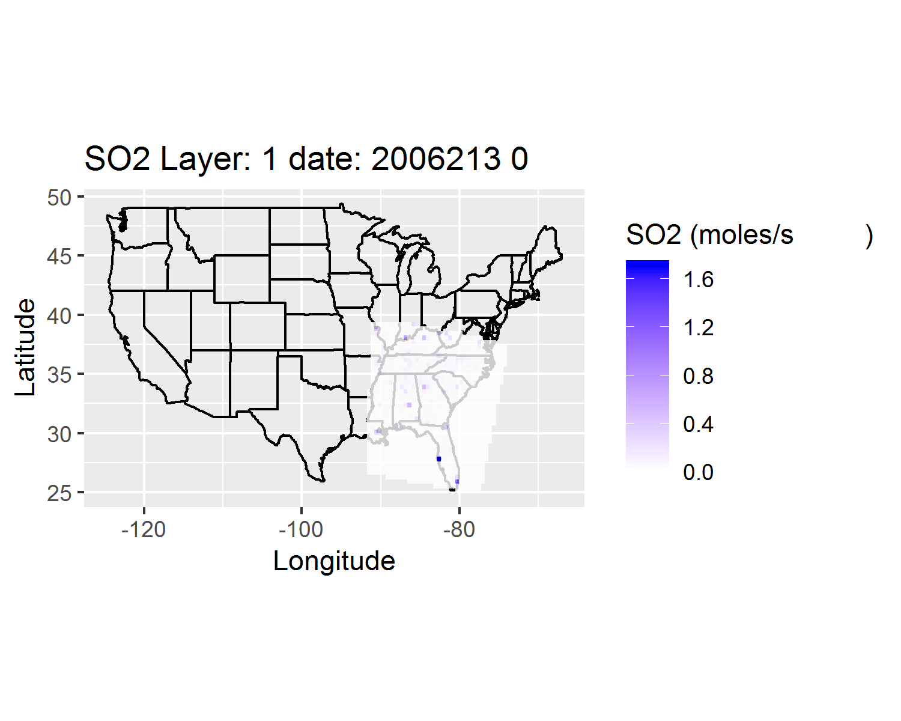

# CMAQ-input
This package is used to modify CMAQ input such as emission, boundary and initial condition, it can also be used to vituralize netcdf files.
<!--- comment out
## This is test

--->
## 1. var_stat  
This is a function to do general statistics on all variable in a ioapi netcdf file.
data_stat(file, path, reportfile) which generates max, min, mean, standard deviation for each variable

## 2. var_add  
This is a function to add a variable into current ioapi netcdf file using current variable with a ratio.
var_add(file, path, inpoll, outpoll, outfile, ratio). This function is usually used to add missing species in initial/boundary condition files, and/or emission files. It copies a original netcdf file to a target netcf file, and adds a variable based on the given inpoll and multiplied with a given ratio. 

When the CMAQ is updated, the species might be changed, you can add a new varible which is a new varible in the new version. This function would be handy, you can add variable to match the species in emission files between previous and current verions.

## 3. var_change  
This is a function to reduce/increase the values in variables with a ratio. For example you would like to reduce all SO2 emission in all grid-cells to half. 
var_change(file, path, inpoll, outfile, ratio)

## 4. tshift  
This is a funciton to change time step, same as m3tshift.
tshift(file, path, source_time, target_time, outfile)

## 5. CMAQmap  
This is a funciton to vituralize CMAQ data.
CMAQ_map(ACON, path1, GRID, path2, poll, TS, LAY, outpath)
example:
20190220 update 2D tile map is ready, but some cells are mislocated, most of them are OK.

## 5. IC-BC-VIR  
This is a funciton to vituralize coundary condition data.
IC_BC_VIR(path, BC, IC, poll, lay, outpath)
example:

